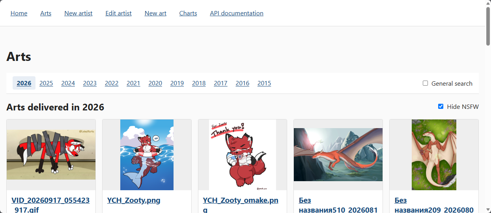

# Artchart

Artchart is a project for maintaining records of art pieces, making them browsable and to 
generate several charts of their attributes for statistical purposes.  
The project is a spring boot application written in kotlin.



## Build

To build the project run `mvn install`.

## Run

To run the project, first create a `.env` file in the project root based on `.env.example`, then use the platform-specific
script:

- PowerShell: `./run.ps1`
- Bash: `./run.sh`

The script loads the variables from `.env` and runs `mvn spring-boot:run` through the Maven wrapper. Additional Maven
arguments can be passed to either script, for example `./run.sh -Dspring-boot.run.profiles=dev`.

## Docker

Build the Docker image from the project root:

```shell
docker build -t artcharts:local .
```

The image contains the executable Spring Boot JAR and exposes port `8080`. Before starting the container, create a
local directory for the artwork files (for example, `./arts`). Mount it at `/art` and point
`ARTCHART_MEDIA_ROOT` to that path inside the container.

PowerShell:

```powershell
docker run --rm --name artcharts `
  -p 8080:8080 `
  --env-file .env `
  -e ARTCHART_SELF_NAME=myName `
  -e ARTCHART_DATASOURCE_URL=jdbc:sqlite:/data/artcharts.db `
  -e ARTCHART_MEDIA_ROOT=/art `
  -v "${DB_FOLDER}\artcharts.db:/data/artcharts.db" `
  -v "${ARTS_FOLDER}:/art:ro" `
  artcharts:local
```

Bash:

```bash
docker run --rm --name artcharts \
  -p 8080:8080 \
  --env-file .env \
  -e ARTCHART_SELF_NAME=myName \
  -e ARTCHART_DATASOURCE_URL=jdbc:sqlite:/data/artcharts.db \
  -e ARTCHART_MEDIA_ROOT=/art \
  -v "$(DB_FOLDER)/artcharts.db:/data/artcharts.db" \
  -v "$(ARTS_FOLDER):/art:ro" \
  artcharts:local
```

Point `$ARTS_FOLDER` and `DB_FOLDER` to the correct path before starting the container. The individual file is
mounted at `/data/artcharts.db`, and the `ARTCHART_DATASOURCE_URL` override makes the application use that path. The
database volume is intentionally mounted without `:ro`, because the application may need to write to the database.

The mounted artwork directory must follow the layout
`<ARTS_FOLDER>/<SFW|NSFW>/<year>/<fileName>`.

## Use

After starting the application, the following entry points are available:

- Web UI: `http://localhost:8080/site`
- Swagger UI: `http://localhost:8080/swagger`
- OpenAPI definition: `http://localhost:8080/apidocs`
- REST API: `http://localhost:8080/api/**`
- Charts: `http://localhost:8080/chart/**`

The web UI is rendered with Thymeleaf and uses HTMX for incremental page updates.

Artwork media is served from the directory configured by `ARTCHART_MEDIA_ROOT`. The expected file layout is
`<ARTCHART_MEDIA_ROOT>/<SFW|NSFW>/<year>/<fileName>`, where the first directory is selected from `Art.isNsfw`. Missing
files are displayed with a placeholder image.
